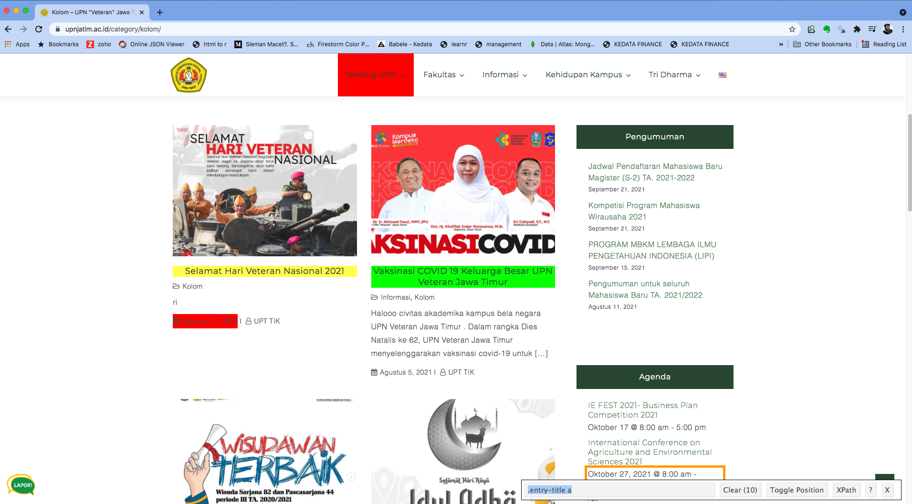

```{r setup, include=FALSE, cache=F, message=F, warning=F, results="hide", eval=FALSE}
knitr::opts_chunk$set(cache=TRUE)
knitr::opts_chunk$set(fig.path='figs/')
knitr::opts_chunk$set(cache.path='cache/')

knitr::opts_chunk$set(
                  fig.process = function(x) {
                      x2 = sub('-\\d+([.][a-z]+)$', '\\1', x)
                      if (file.rename(x, x2)) x2 else x
                      }
                  )
library(tidyverse)
library(stevemisc)
```

Salam kenal dan selamat datang.

Semoga kita semua bisa saling berbagi pengalaman dan pengetahuan. Saya adalah Ujang Fahmi, Co-founder dan mentor Sadasa Academy.

\vspace{0.1in}

Jika anda berada dan sedang membaca tutorial ini, maka kemungkinan anda adalah orang yang sedang ingin belajar data sains, atau mungkin ditugaskan untuk mempelajari R oleh institusi atau organisasi anda. Sama seperti saya dulu, dimana tanpa latar belakang enginering saya didiharuskan untuk belajar R, demi menyelesaikan tugas akhir dan akhirnya jadilah seperti saya sekarang ini.

\vspace{0.1in}

Satu hal yang pasti, ini adalah langkah pertama dari banyak langkah yang harus dilalui, entah melalui lembaga resmi atau belajar secara mandiri. Jadi selamat belajar!!!

\vspace{0.1in}
Ujang Fahmi, 

`r paste("Yogyakarta,", Sys.Date())`

\vspace{0.1in}

*Materi yang disampaikan disimpan dan dokumentasikan* [**disini**](https://github.com/eppofahmi/belajaR/tree/master/upn-surabaya)

# Memahami Web Scrapping

## Apa?

Web Scarping adalah proses mengumpulkan data tertstruk dari sebuah web yang biasanya dilakukan secara otomatis. Istilah lain yang juga sering digunakan adalah ekstraksi data web. 

\vspace{0.1in}

Walaupun memiliki tujuan yang kurang lebih sama, web scraping memiliki perbedaan dengan web crawling. Crawling yang juga digunakan oleh mesin-mesin pencarian umumnya mengindek semua informasi dari sebuah tautan atau web halaman demi halaman hingga halaman atau baris terakhir. Sementara Scraping digunakan untuk mengumpulkan data secara spesifik dari sebuah tautan atau website. 

## Bagaimana?

1. Web scraping biasanya menggunakan alat yang dibuat secara manual untuk melakukan tugas mengambil data spesifik dari sebuah website. Alat tersebut umumnya disebut scraper. 
2. Scraper memanfaatkan data locator/selector untuk mendapatkan/mengekstrak data dari file HTML.
3. Locator biasanya berupa Xpath, CSS Selector, regex, atau gabungan ketiganya. 


# `Rvest` untuk scraping

`Rvest` merupakan package yang bisa digunakan untuk melakukan scraping di R. Package ini memiliki fungsi-fungsi untuk mengekstrak: 

1. Teks;
2. Atribut, seperti url;
3. Html nodes; dan
4. Tabel

dari dalam sebuah file HTML atau website. Selain itu, `rvest` juga memiliki fitur lain sepertu memasukan data pada google form dan lain sebagainya. 

## Mengenal Website

Untuk bisa melakukan scraping maka kita harus terlebih dahulu paham tentang penyusun sebuah Website yang mungkin sudah tiap hari dikonsumsi. Sebuah WEB umumnya terdiri dari:

1. HTML untuk menyusun data yang akan ditampilkan;
2. CSS untuk mempercantik tampilan data dalam sebuah website; dan
3. Javascript untuk mengatur interaksi dalam sebuah web.

## Memilih Tag HTML

::: {.columns}
::: {.column width="40%"}

Untuk memilih locator kita bisa melakukan inspect element pada sebuah website atau menggunakan selectorGadget seperti pada gambar berikut. 

Pada web tersebut, misalnya kita ingin mendapatkan judul maka locator yang bisa digunakan berdasarkan `selectorGadget` adalah `.entry-title a`

:::
  
::: {.column width="60%"}



:::
:::

## Mengambil Data dari Tag

Untuk mengambil data dengan cara scraping di R setidaknya kita harus melakukan dengan tahapan sebagai berikut. 

1. Mengunduh html dengan `read_html()`
2. Menentukan locator/nodes dalam rves dengan `html_nodes()`
3. Menentukan data yang akan diambil berupa teks, link, atau tabel dengan `html_text()`, `html_attr()` atau `html_attrs()`, dan `html_table()`.

# Persiapan

Untuk bisa melakukan scraping, kita mau tidak mau harus mengenal tag yang digunakan di HTML. Tag ada penanda umum yang menandai sebuah elemen dalam html. Untuk itu sebelum melakukan scraping sebaiknya kita tahu. 

1. Url web dan kebiasannya
2. Konten yang akan diambil
3. HTML tag dari konten yang akan diambil (Bisa menggunakan `SelectorGadget`)

`SelectorGadget` merupakan sebuah tool untuk memudahkan memilih elemen css untuk mendapatkan data yang diingkan. `SelectorGadget` bisa didapat dengan menambahkannya pada browser yang anda gunakan. Untuk chrome bisa klik [tautan ini](https://chrome.google.com/webstore/detail/selectorgadget/mhjhnkcfbdhnjickkkdbjoemdmbfginb?hl=en).

## URL webpage

1. Halaman 1: https://onlinelibrary.wiley.com/action/doSearch?Ppub=&field1=AllField&field2=AllField&field3=AllField&text1=public+communication&text2=pandemic&text3=&pageSize=20&startPage=1

2. Halaman 2: https://onlinelibrary.wiley.com/action/doSearch?Ppub=&field1=AllField&field2=AllField&field3=AllField&text1=public+communication&text2=pandemic&text3=&pageSize=20&startPage=2

3. Halaman 3: https://onlinelibrary.wiley.com/action/doSearch?Ppub=&field1=AllField&field2=AllField&field3=AllField&text1=public+communication&text2=pandemic&text3=&pageSize=20&startPage=3


## Target data

Target: Mendapatkan data jurnal dengan katakunci public communication and pandemic dengan target mendapatkan: 

1. Judul
2. Penulis
3. Tahun; dan
4. Link DOI

## Judul 

urls = https://onlinelibrary.wiley.com/action/doSearch?field1=AllField&text1=public+communication&field2=AllField&text2=pandemic&field3=AllField&text3=&Ppub=

```{r, eval=FALSE}
library(rvest)
url1 <- read_html(urls)

judul <- data_frame(judul = url1 %>% 
  html_nodes('.hlFld-Title a') %>% 
  html_text(trim = TRUE))
```

## Penulis

```{r, eval=FALSE}
penulis <- data_frame(penulis = url1 %>% 
  html_nodes('.comma') %>% 
  html_text(trim = FALSE))
```

## Tahun 

```{r, eval=FALSE}
tahun_terbit <- data_frame(tahun = url1 %>% 
  html_nodes('.meta__epubDate') %>% 
  html_text(trim = FALSE))
```

## Doi

```{r, eval=FALSE}
doi <- url1 %>%
  html_nodes(".hlFld-Title a") %>% 
  html_attr("href")

doi <- data_frame(doi)
doi$doi <- paste0("https://onlinelibrary.wiley.com", doi$doi)

data_all <- bind_cols(judul, tahun_terbit, penulis, doi)
data_all$doi
```

# Your Turn 

> Cobalah lakukan scraping pada sebuah website dengan menggunakan `rvest`!
