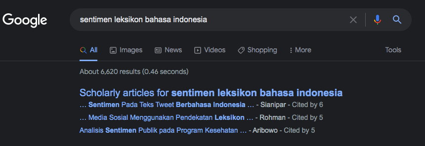
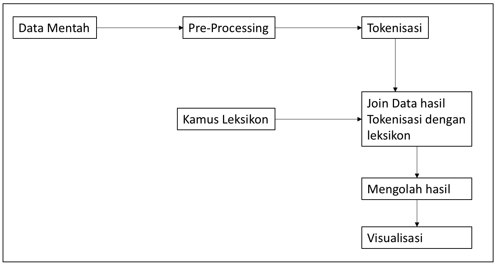
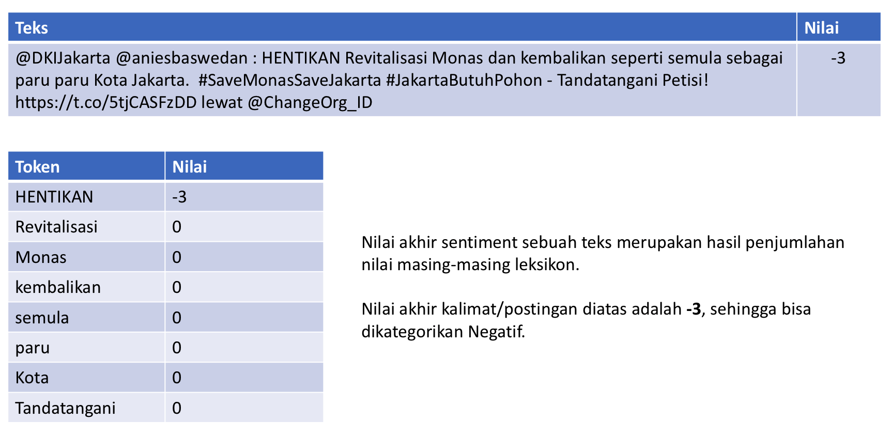

```{r setup, include=FALSE, cache=F, message=F, warning=F, results="hide"}
knitr::opts_chunk$set(cache=TRUE)
knitr::opts_chunk$set(fig.path='figs/')
knitr::opts_chunk$set(cache.path='cache/')

knitr::opts_chunk$set(
                  fig.process = function(x) {
                      x2 = sub('-\\d+([.][a-z]+)$', '\\1', x)
                      if (file.rename(x, x2)) x2 else x
                      }
                  )
library(tidyverse)
library(stevemisc)
```

Salam kenal dan selamat datang.

Semoga kita semua bisa saling berbagi pengalaman dan pengetahuan. Saya adalah Ujang Fahmi, Co-founder dan mentor Sadasa Academy.

\vspace{0.1in}

Jika anda berada dan sedang membaca tutorial ini, maka kemungkinan anda adalah orang yang sedang ingin belajar data sains, atau mungkin ditugaskan untuk mempelajari R oleh institusi atau organisasi anda. Sama seperti saya dulu, dimana tanpa latar belakang enginering saya didiharuskan untuk belajar R, demi menyelesaikan tugas akhir dan akhirnya jadilah seperti saya sekarang ini.

\vspace{0.1in}

Satu hal yang pasti, ini adalah langkah pertama dari banyak langkah yang harus dilalui, entah melalui lembaga resmi atau belajar secara mandiri. Jadi selamat belajar!!!

\vspace{0.1in}
Ujang Fahmi, 

`r paste("Yogyakarta,", Sys.Date())`

\vspace{0.1in}

*Materi yang disampaikan disimpan dan dokumentasikan* [**disini**](https://github.com/eppofahmi/belajaR/tree/master/upn-surabaya)

# Analisis Sentimen

## Apa?

Analisis sentimen adalah sebuah proses mendeteksi sentimen positif atau negataif dalam sebuah teks. Hal ini sering digunakan untuk mendeteksi data sosial, reputasi aktor/nama/brand dan memahami apa yang dibicarakan dalam teks.

\vspace{0.1in}

Misalnya, sebuah perusahaan dapat melakukan analisis sentimen untuk mengetahui apakah konsumennya senang dengan produk/layanan atau brandnya. Data yang digunakan misalnya postingan di Twitter dengan hashtag terkait dengan perusahaannya. 

## Bagiamana?

Sentimen analisis bisa dilakukan dengan dua cara: 

1. Lexicon Based
2. Supervised Machine Learning

Di sini, kita akan mencoba untuk membuat sentimen analisis dengan menggunakan leksikon terlebih dahulu. Hasil yang didapat kemudian bisa dijadikan sebagai basis pembuatan data latih untuk membuat supervised machine learning atau juga bisa diinterpretasikan secara langsung. 

## Leksikon

Leksikon pada dasarnya merupakan sebuah kamus di mana setiap term/kata memiliki sebuah value. Value untuk setiap term tersebut merupakan hasil penelitian yang umumnya dilakukan oleh akademisi dengan basis linguistik. 

Di `R` terdapat beberapa leksikon yang bisa digunakan dari package yang ada. Misalnya dalam library `tidytext` terdapat leksikon `bing`, `afinn`, `loughran` dan `nrc`, untuk mendapatkannya bisa menggunakan skrip berikut: 

```{r, eval=FALSE}
library(tidytext)
bing_lex = get_sentiments("bing")
head(bing_lex)
```

## Perbedaan antar leksikon 1

::: {.columns}
::: {.column width="50%"}

Leksikon `bing`

```{r, echo=FALSE}
library(tidytext)
bing_lex = get_sentiments("bing")
bing_lex %>% 
   head(5) %>%
   knitr::kable()
```

:::
  
::: {.column width="50%"}

Leksikon `afinn`

```{r, echo=FALSE}
library(tidytext)
afinn_lex = get_sentiments("afinn")
afinn_lex %>% 
   head(5) %>% 
   knitr::kable()
```

:::
:::

## Perbedaan antar leksikon 2

::: {.columns}
::: {.column width="50%"}

Leksikon `loughran`

```{r, echo=FALSE}
library(tidytext)
bing_lex = get_sentiments("loughran")
bing_lex %>% 
   head(5) %>%
   knitr::kable()
```

:::
  
::: {.column width="50%"}

Leksikon `nrc`

```{r, echo=FALSE}
library(tidytext)
afinn_lex = get_sentiments("nrc")
afinn_lex %>% 
   head(5) %>% 
   knitr::kable()
```

:::
:::

## Leksinkon Bahasa Indonesia



Sama dengan bahasa Inggris, leksikon untuk analisis sentimen dalam bahasa Indonesia juga sudah banyak diteliti dengan berbagai macam metode. Kita bisa mencari artikel ilmiah dan juga kamus nya untuk kemudian digunakan yang salah satunya bisa didapat [disini](https://github.com/fajri91/InSet).

# Langkah-langkah analisis sentimen



## Penghitungan sentimen



## Persiapan 

### Data yang akan dianalisis

```{r, eval=FALSE}
library(tidyverse)
library(tidytext)

raw_data = read_csv("data/tweet_save_monas.csv")
raw_data = raw_data %>% 
   select(id, created_at, full_text, full_text_clean, 
          reply_count, retweet_count, like_count) %>% 
   filter(!is.na(full_text_clean)) %>% 
   filter(!duplicated(id))
glimpse(raw_data)
```

### Leksikon yang akan digunakan 

Leksikon yang akan digunakan dapat diambil dari tautan berikut: 

1. Leksikon Positif: https://raw.githubusercontent.com/fajri91/InSet/master/positive.tsv
2. Leksikon Negatif: https://raw.githubusercontent.com/fajri91/InSet/master/negative.tsv

```{r, echo=TRUE, eval=FALSE}
library(tidyverse)

id_pos = read_tsv("ganti dengan tautan")
id_neg = read_tsv("ganti dengan tautan")
id_sentimen = bind_rows(id_pos, id_neg)
glimpse(id_sentimen)
```

### Tokenisasi Data

```{r, eval=FALSE}
data_token = raw_data %>% 
   group_by(id) %>% 
   unnest_tokens(word, full_text_clean, token = "words")

glimpse(data_token)
```

### Join dengan leksikon

Setelah melakukan tokenisasi, kita bisa menggabungkan data hasil tokenisasi dengan kamus leksikon. Sehingga data yang didapatkan adalah data dengan nilai berupa numerik. 

```{r, eval=FALSE}
hasil = data_token %>% 
   inner_join(id_sentimen)

hasil = hasil %>% 
   group_by(id) %>% 
   summarise(nilai_akhir = sum(weight))

glimpse(hasil)
```

### Join dengan data asli

```{r, eval=FALSE}
# penggabungan
hasil_akhir = raw_data %>% 
   left_join(hasil)
# nilai NA menjadi 0
hasil_akhir$nilai_akhir[is.na(hasil_akhir$nilai_akhir)] = 0
# memberi label
hasil_akhir = hasil_akhir %>% 
   mutate(sentimen = case_when(
      nilai_akhir == 0 ~ "Netral", 
      nilai_akhir >= 1 ~ "Positif", 
      TRUE ~ "Negatif"
   ))

glimpse(hasil_akhir)
View(hasil_akhir)
```

## Melihat Hasil

### Persentase sentimen 

```{r, eval=FALSE}
persen_sentimen = hasil_akhir %>% 
   count(sentimen) %>% 
   mutate(persen = round(n/sum(n)*100))

library(echarts4r)
persen_sentimen %>% 
   e_chart(x = sentimen) %>% 
   e_pie(persen)
```

## Distribusi Sentimen

```{r, eval=FALSE}
distribusi_sentimen = hasil_akhir %>% 
   separate(created_at, into = c("created_at", "jam"), sep = " ") %>% 
   group_by(created_at) %>% 
   count(sentimen)

distribusi_sentimen$created_at = 
   as.Date(distribusi_sentimen$created_at)
glimpse(distribusi_sentimen)

distribusi_sentimen %>% 
   ggplot(aes(x = created_at, y = n, color = sentimen)) + 
   geom_line()
```

