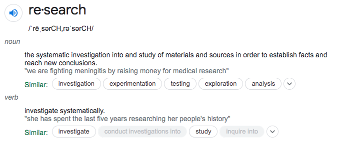
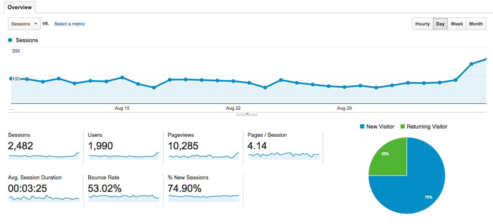
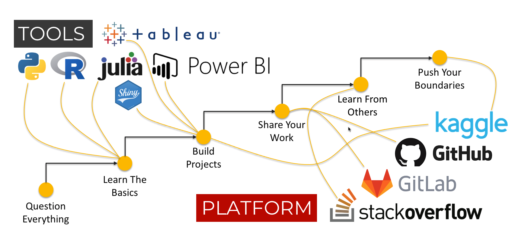
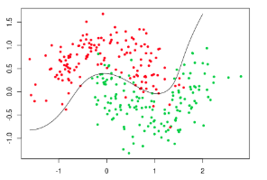
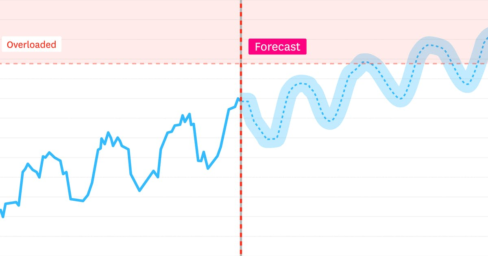
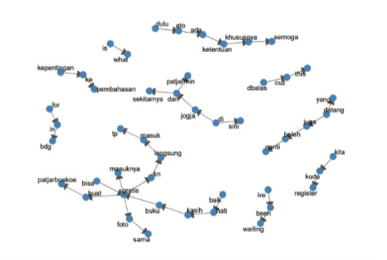

```{r setup, include=FALSE, cache=F, message=F, warning=F, results="hide"}
knitr::opts_chunk$set(cache=TRUE)
knitr::opts_chunk$set(fig.path='figs/')
knitr::opts_chunk$set(cache.path='cache/')

knitr::opts_chunk$set(
                  fig.process = function(x) {
                      x2 = sub('-\\d+([.][a-z]+)$', '\\1', x)
                      if (file.rename(x, x2)) x2 else x
                      }
                  )
library(tidyverse)
library(stevemisc)
```

dSalam kenal, saya adalah Ujang Fahmi, pengajar dan Co-Founder Sadasa Academi dan Kedata Indonesia digital. Sadasa adalah sebuah startup pengajaran data sains dari 0 hingga mahir. Kedata adalah startup dibidang big data analytis. 

Saya bukanlah orang dengan latar belakang pendidikan teknik, S1 saya adalah Hubungan Internasional, dan S2 saya, Kebijakan Publik. Sebagian besar keterampilan *ngoding* saya pelajari secara otodidak dengan memproduksi `error` yang tidak terhitung hingga saat ini yang sudah saya coba cari solusinya. 

Kemungkinan, jika ada yang sedang membaca atau memiliki slides ini juga tertarik untuk belajar tentang analisis big data atau digital. Satu hal yang saya bisa katakan untuk itu, bidang ini sangat terbuka bagi siapa saja yang mau dan bisa meluangkan waktu secara konsisten untuk belajar. 

Jadi, selemat belajar!...

`r paste("Yogyakarta,", Sys.Date())`

# Pendahuluan

## Digital


## Analisis

> Analytics is the process of discovering, interpreting, and communicating significant patterns in data. . Quite simply, analytics helps us see insights and meaningful data that we might not otherwise detect.

## Analisis Digital

> Digital analytics is the process of analyzing digital data from various sources like websites, mobile applications, among others. It provides a clear vision to the organization on how users or customers are behaving. Through digital analytics, companies obtain an insight into the areas where they need improvement.

## Penelitian



# Alat, Metode dan Pendekatan

## Alat

### Google analytics



### Tebleu


### Bahasa Pemerograman 


### Belajarnya mulai darimana?


## Metode

::: {.columns}
::: {.column width="50%"}

Secara umum, metode yang biasa digunakan untuk mengolah berbagai data digital baik yang terstruktur dan tidak terstruktur dapat dibagi menjadi 3, yaitu: 

1. Klasifikasi
2. Klastering
3. Prediksi

:::
  
::: {.column width="50%"}


:::
:::

### Klasifikasi

::: {.columns}
::: {.column width="50%"}
Klasifikasi merupakan sebuah proses untuk membuat pengelompokkan berdasarkan karakteristik yang dimiliki oleh data menjadi kelompok-kelompok spesifik yang sudah diketahui. 

Misalnya, pengelompokkan data siswa berdasarkan gender. Gender yang mungkin ada sudah diketahui, yaitu Laki-laki dan perempuan. 
:::
::: {.column width="50%"}



:::
:::

### Klastering

::: {.columns}
::: {.column width="50%"}

Klastering merupakan sebuah proses untuk membuat pengelompokkan berdasarkan karakteristik yang dimiliki oleh data menjadi kelompok-kelompok spesifik yang belum diketahui. 

Misalnya, pengelompokkan topik pembicaraan warganet di Twitter, dimana tidak ada informasi yang memberitahu dengan pasti ada berapa topik, dan topik tentang apa saja. 

:::
  
::: {.column width="50%"}


:::
:::

### Prediksi



# Analitik Digital

## Metode Hibrida

Sebuah metode yang menggabungkan antara teknik-tekni data/text mining dengan metode-metode lain yang sudah lebih dulu stabil sebagai sebuah cara mengungkap informasi dari dalam sebuah data. 

### Contoh Kasus

- Kita ingin mengetahui ada berapa kelompok, dan kelompok apa saja yang terlibat dalam sebuah wacana atau tagar yang berkembang di media Twitter.

- Karena kita ingin mengetahui kelompok namun belum mengetahui jumlah atau jenis pastinya, kita bisa menggunakan metode-metode klastering. 

- Metode klastering akan menghasilkan sejumlah kelompok, namun kita belum tahu itu kelompok apa saja

- Untuk mengetahui kelompok-kelompok yang ada terkait dengan apa saja, langkah logis yang bisa digunakan adalah dengan mengetahui apa yang mereka katakan. 

- Untuk mengetahui yang mereka katakan, kita perlu melakukan kajian terhadap teks yang meraka (per kelompok) posting. 

- Langkah paling sederhana untuk mengetahui apa yang tiap kelompok katakan adalah dengan mengetahui buzzword (jumlah masing-masing kata digunakan)

- Apakah ini sudah cukup? sepertinya belum!

### Mengetahui konteks kata

- Untuk mengetahui atau bahkan mendefinisikan sesuatu (kelompok) berdasarkan yang mereka tulis, kita juga perlu tahu konteks dari tiap kata yang dipilih. 

- Studi wacana sepertinya cocok dengan karakteristik permasalahan dan tujuan analisis yang ingin dicapai

- Ada sebuah metode yang disebut CADS (Corpus assited discourse Studies)

### Term Network 

::: {.columns}
::: {.column width="50%"}

Network term, merupakan salah satu bentuk dasar dari jejaring semantik. Tujuan utamanya adalah untuk mengetahui kata sebelum dan setelahnya. 

Dengan pengetahuan kata sebelum dan setelah dan di visualisasi sebagai network, memungkinkan observer membaca secara keseluruhan konteks dari kata dan menentukan fokus dengan lebih cepat. 

:::
  
::: {.column width="50%"}


:::
:::

# Penutup 

- Setiap penelitian memiliki karakteristik utama yaitu, sistematis dan logis
- Metode perlu menyesuaikan tujuan dan data yang akan diolah 
- Untuk menggunakan metode campuran, gabungan, atau hibrida, perlu penguasaan ilmu yang multidisiplin
- Kolaborasi sepertinya telah menjadi kebutuhan, termasuk dalam melakukan penelitian