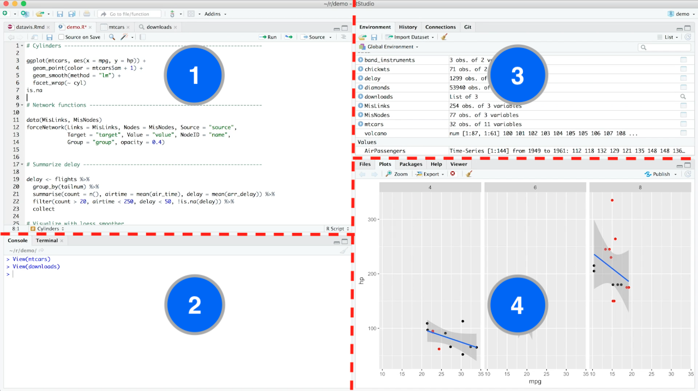
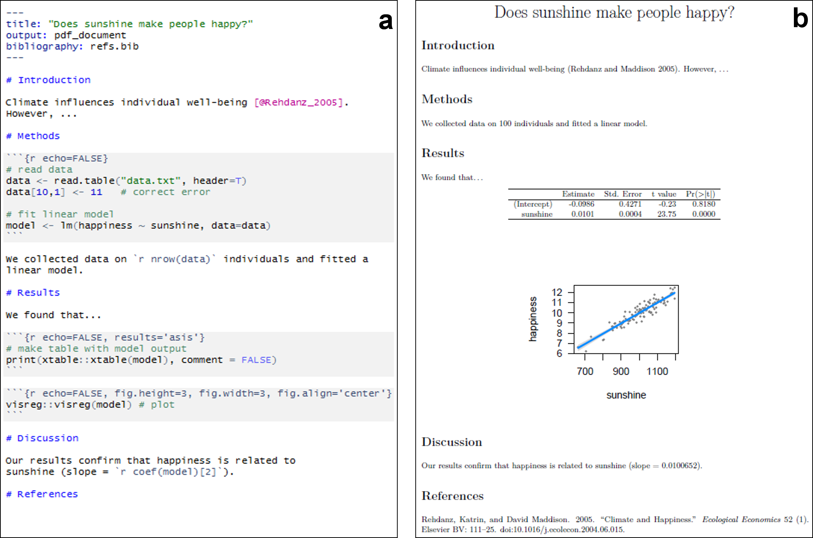

```{r setup, include=FALSE, cache=F, message=F, warning=F, results="hide"}
knitr::opts_chunk$set(cache=TRUE, echo=TRUE, message=FALSE, warning=FALSE, eval=FALSE)
knitr::opts_chunk$set(fig.path='figs/')
knitr::opts_chunk$set(cache.path='cache/')

knitr::opts_chunk$set(
                  fig.process = function(x) {
                      x2 = sub('-\\d+([.][a-z]+)$', '\\1', x)
                      if (file.rename(x, x2)) x2 else x
                      }
                  )
library(tidyverse)
library(stevemisc)
```

Salam kenal dan selamat datang.

Semoga kita semua bisa saling berbagi pengalaman dan pengetahuan. Saya adalah Ujang Fahmi, Co-founder dan mentor Sadasa Academy.

\vspace{0.1in}

Jika anda berada dan sedang membaca tutorial ini, maka kemungkinan anda adalah orang yang sedang ingin belajar data sains, atau mungkin ditugaskan untuk mempelajari R oleh institusi atau organisasi anda. Sama seperti saya dulu, dimana tanpa latar belakang enginering saya didiharuskan untuk belajar R, demi menyelesaikan tugas akhir dan akhirnya jadilah seperti saya sekarang ini.

\vspace{0.1in}

Satu hal yang pasti, ini adalah langkah pertama dari banyak langkah yang harus dilalui, entah melalui lembaga resmi atau belajar secara mandiri. Jadi selamat belajar!!!

\vspace{0.1in}
Ujang Fahmi, 

`r paste("Yogyakarta,", Sys.Date())`

\vspace{0.1in}

*Materi yang disampaikan disimpan dan dokumentasikan* [**disini**](https://github.com/eppofahmi/belajaR/tree/master/upn-surabaya)


# Pengenalan Data Sains

## Apa itu data sains?

::: {.columns}
::: {.column width="50%"}
Data Sains merupakan sebuah bidang inter atau bahkan multidisiplin yang menggunakan metode-metode saintifik, proses, algoritma, dan sistem untuk mengekstrak pengetahuan dari data yang terstruktur, tidak terstruktur dan bercabang.

-   Memiliki keterampilan koding
-   Mengetahui dan menguasai matematika dan statistik
-   Memiliki domain knowledge spesifik yang kuat
:::

::: {.column width="50%"}
Keterampilan data seorang data saintis 
:::
:::

## Sosial data sains?

::: {.columns}
::: {.column width="40%"}
Social data science is a new discipline combining the social sciences and computer science in which the analysis of big data is linked to social scientific theory and analysis.
:::

::: {.column width="60%"}
[https://www.ox.ac.uk/](https://www.ox.ac.uk/admissions/graduate/courses/msc-social-data-science)


:::
:::

## Alat-alat yang biasa digunakan

::: {.columns}
::: {.column width="50%"}
### Umum

Bahasa pemerograman yang biasa digunakan untuk mengolah data

-   R - [statistical programming language](https://www.r-project.org/)
-   Python - [general programming language](https://www.python.org/)
-   Julia - [programming language untuk big data](https://julialang.org/)
:::

::: {.column width="50%"}
### Spesifik

Perangkat lunak yang biasa digunakan untuk mengolah data dengan tujuan spesifik

-   Gephi - [Network Analysis](https://gephi.org/)
-   Nodexl - [Network Analysis](https://nodexl.com/)
-   Orange - [Data Mining](https://orangedatamining.com/)
:::
:::

## Harus menggunakan yang mana?

-   Pilih yang sudah banyak digunakan oleh orang lain
-   Pilih yang memiliki komunitas yang kuat baik di dunia maupun di negara kita
-   Pilih yang sesuai dengan kebutuhan
-   Pelajari semuanya, pilih salah satu untuk dikuasai

# R dan Rstudio

## Kenapa menggunakan R dan Rstudio

::: {.columns}
::: {.column width="50%"}
-   `R` adalah bahasa pemerogramannya
-   `R Studio` adalah perangkat lunak yang menjadi interpreter `R`
-   `R Studio` adalah merupakan salah satu lembaga yang berkontribusi besar dalam perkembangan `R`
-   Apakah R bisa dijalankan di IDE lain? Ya, bisa. Misalnya di `VsCode`
:::

::: {.column width="50%"}

:::
:::

## Mendapatakan R dan Rstudio

::: {.columns}
::: {.column width="50%"}
-   R bisa didapatkan di <https://www.r-project.org/>
-   R Studio bisa didapatkan di <https://www.rstudio.com/products/rstudio/download/>
:::

::: {.column width="50%"}

:::
:::

## Bisa apa saja dengan R dan Rstudio

Saat ini dengan menggunakan R dan Rstudio kita hampir bisa melakukan semua kegiatan yang berkaitan dengan pengolahan data, misalnya:

-   Mendapatkan data
-   Melakukan manipulasi atau pra-pemerosesan
-   Membuat analisis dengan statistik, Macine Learning dan Deep Learning
-   Membuat laporan hasil pengolahan data
-   Membuat dashboard hasil pengolahan data

## Gallery Shiny Dashboard


[sumber: rstudio](https://shiny.rstudio.com/gallery/#user-showcase)


# Menggunakan R dan Rstudio



## Membuat Proyek
::: {.columns}
::: {.column width="50%"}

Project merupakan sebuah folder seperti yang sudah sering kita buat. Di R folder tersebut difungsikan untuk menyimpan segala sesuatu yang kita buat di Rstudio secara otomatis kedalam folder tersebut. Keuntungan yang didapatkan adalah kita memiliki fokus folder yang sedang menjadi tempat kerja kita.

1. File 
2. New Project
3. New Directory
4. New Project
5. Directory Name
6. Create Project

:::
::: {.column width="50%"}

Kenapa?

Karena di R kita **hanya akan bisa mengolah data yang bisa diimpor kedalam R** atau benar-benar eksis dalam lingkungan R. 


:::
:::

## Membuat dan menyimpan skrip/kumpulan perintah
::: {.columns}
::: {.column width="50%"}

Skrip adalah kumpulan perintah yang kita buat untuk menyelesaikan atau melakukan sesuatu dengan bahasa tertentu. Di R kita bisa membuat beberapa skrip sesuai dengan peruntukannya. 

1. R Scirpt `(.R)` umumnya digunakan untuk melakukan pengolahan data
2. R Markdown `(.Rmd)` umumnya digunakan untuk membuat laporan
3. Script-script lain yang biasa digunakan di pemerogaman seperti C, C++. CSS, dan lain sejennisnya

:::
::: {.column width="50%"}

:::
:::

## Aturan menulis skrip
::: {.columns}
::: {.column width="50%"}

**UMUM**

1. Nama objek tidak boleh menggunakan spasi atau diawali dengan angka (`1namaobjek`, `nama objek`)
2. Setiap perintah yang didahului dengan tanda pagar (`#`) dibaca sebagai komentar
3. Komentar tidak akan dibaca sebagai perintah dan berfungsi untuk memberikan keterangan tambahan pada penulis atau yang menggunakan skrip
5. Objek di `R` bisa dibuat dengan menggunakan assigment. Misalnya `data1 = 12 * 19827` atau `data1 <-12 * 19827`
:::

::: {.column width="50%"}

**Khusus**


:::
:::

## Jenis skrip di Rstudio

::: {.columns}
::: {.column width="50%"}

SKRIP R


:::

::: {.column width="50%"}

R MARKDOWN


:::
:::

# Library dan Package

## Apa Library dan Package?

::: {.columns}
::: {.column width="50%"}

:::

::: {.column width="50%"}


:::
:::

## Mendapatkan Library

- Library atau package hanya perlu diinstall sekali 
- Library dan package perlu dipanggil kembali dalam setiap sesi baru R
- Sebuah sesi baru di R dimulai dari saat membuka atau merstart R hingga menutup atau merestart kembali
- Semua Library dan package dibuat secara terbuka (seperti wikipedia)
- Library dan package dapat diinstall dengan menggunakan sintaks `install.packages(namaPackage)`
- Library dan package sama-sama dipanggil menggunakan sintak `library()`
- Semua Library dan package yang dikelola di kurasi oelh R dapat dilihat di: https://cran.r-project.org/

## Menggunakan fungsi dalam package

Fungsi dalam r terdiri dari nama_fungsi(argumen1, argumen2, dst). Bisanya dibuat dengan cara sebagai berikut. 

```{r, eval=FALSE}
# pembuatan fungsi
fungsi_modulo <- function(argumen1){
  hasil = argumen1%%2
  return(hasil)
}

# penggunaan fungsi
fungsi_modulo(argumen1 = 7)
```

Setiap fungsi dari dalam pacakge juga memiliki format seperti, sehingga ketika kita akan menggunakannya kita perlu tahu terlebih dahulu argumen yang dibutuhkannya. 

## Your Turn 1!

1.  Buatlah sebuah project di Rstudio!
2.  Buatlah sebuah skrip `.R` di project yang telah dibuat!
3.  Tulislah perintah untuk menginstall package `tidyverse`, `tidytext`, dan `igraph`!

# Fungsi-fungsi Dasar {#fungsidasar}

## Fungsi paste
::: {.columns}
::: {.column width="40%"}

Terdapat dua fungsi paste, yaitu `paste()` dan `paste0()`. Keduanya memiliki fungsi utama yang sama yaitu untuk meletakan sebuah objek berdampingan dengan objek lainnya. 

> Mirip dengan fungsi paste yang mungkin telah sering kita gunakan saat menggunakan komputer

:::
::: {.column width="60%"}

Contoh:

```{r, echo=TRUE,message=FALSE, warning=FALSE, eval=FALSE}
teks1 <- "aku adalah"
teks2 <- "raja rimba"

teks12 <- paste(teks1, teks2, sep = " ")
teks12

teks0 <- paste0(teks1, teks2)
teks0

teks <- paste0(teks1, " ", teks2)
teks
```

:::
:::

## Fungsi if dan else

::: {.columns}
::: {.column width="45%"}
Fungsi ini digunakan untuk memilih output sesuai dengan kondisi yang sudah ditentukan. Sering dinyatakan dengan `JIKA ... MAKA ...`.


Kondisinya Nilai Tim A = 10, sementara Nilai Tim B = 8, skrip di R bisa dibaca JIKA `nilai tim A lebih dari tim B` MAKA cetak tulisan `TIM A adalah juaranya` jika tidak MAKA cetak `TIM B adalah juaranya`
:::
  
::: {.column width="55%"}

Contoh: 

```{r, echo=TRUE,message=FALSE, warning=FALSE, eval=FALSE}
Tim_A = 10
Tim_B = 8

if (Tim_A > Tim_B) {
  print("Tim A adalah juaranya")
} else if(Tim_A == Tim_B){
  print("Seri")
} else {
  print("Tim B adalah juaranya")
  }
```

:::
:::

## Fungsi for-Loop

::: {.columns}
::: {.column width="50%"}

Fungsi `for-Loop` juga disebut perluangan. Digunakan untuk melakukan hal-hal yang sama secara berulang sesuai dengan batas yang ditentukan. 

Fungsi ini akan terasa manfaatnya jika kita memiliki data yang cukup banyak dan harus melakukan sebuah hal yang sama pada setiap observasi yang dimiliki. 

:::
  
::: {.column width="50%"}

Contoh:

```{r}
for (value in vector){
  statements
}

vektor <- c(1:5)
# loop 
for(i in vektor){
  print(i)
}
```

:::
:::

## Fungsi-fungsi untuk melihat data (`str()`, `class()` dan `summary()`)
::: {.columns}
::: {.column width="50%"}

Fungsi-fungsi di atas digunankan untuk melihat struktur, kelas, dan rangkuman data. `str()` bisa dibaca struktur, `class()` atau kelas digunakan untuk mengetahui jenis data yang ada dalam data, apakah ia data frame, list, matrix atau lainnya. Sementara summary akan lebih banyak digunakan saat melakukan eksplorasi data. 

:::
  
::: {.column width="50%"}

```{r}
library(tidyverse)

df1 = mtcars

str(df1)
class(df1)
summary(df1)
```

:::
:::

## Your Turn 2!

1. Data A = 6 dan B = 187, jika A = genap, dan B = Ganjil, maka cetak "Ganjil Genap", jika A dan B genap, maka cetak "Genap", JIKA A dan B ganjil semua maka cetak Ganjil, JIKA A ganjil dan B genap, maka cetak "Ganjil genap", JIKA tidak memenuhi kondisi sebelumnya, maka cetak "genap". 

```{r, include=FALSE, eval=FALSE}
A = 2
B = 3

if(A %% 2 == 0 & B %% 2 != 0){
  print("Genap Ganjil")
} else if(A %% 2 != 0 & B %% 2 == 0){
  print("Ganjil Genap")
} else if(A %% 2 == 0 & B %% 2 == 0){
  print("Genap")
} else {
  print("Ganjil")
}
```

2. A adalah sebuah distribusi angka antara 10 sampai dengan 1000 sebanyak 100, buatlah fungsi loop dimana setiap menemukan angka genap console mencetak "Genap" sementara jika menemukan angka ganjil tidak mencetak apapun. 

```{r, include=FALSE, eval=FALSE}
A = sample(10:1000, 100)

for (i in seq_along(1:length(A))) {
  if(A[i] %% 2 == 0){
    print("Genap")
  } else {
    print(i)
  }
}
```


# Jenis-jenis data yang umum digunakan {#dataType}

## Vectors
::: {.columns}
::: {.column width="35%"}

Vector merupakan sebuah tipe data gabungan yang berisi beberapa elemen `atomic` berjenis sama. Untuk membuat sebuah vector, digunakan perintah kombinasi `c()`. 

Untuk mengakses vector bisa menggunakan tanda `namaVector[]`. Misalnya, `a[1]`, berarti mengakses vektor ke-1 dari `a`.

:::
::: {.column width="65%"}

Contoh:

```{r, eval=FALSE}
a <- c(1,2,5.3,6,-2,4)
b <- c("one","two","three")
c <- c(TRUE,TRUE,FALSE,TRUE,FALSE)
```

:::
:::

## Data Frame
::: {.columns}
::: {.column width="50%"}

Data frame juga disebut data flat atau rata, yaitu sebuah data yang setiap barisnya memiliki kolom yang sama, dan setiap kolomnya memiliki baris yang sama. 

Untuk mengakses data frame bisa menggunaan tanda dollar `$`. Misalnya `datasiswa$name`, berarti mengakses kolom `name` dari data `datasiswa`. Sementara jika `datasiswa$name[3]`, berarti mengakses bari ke-3 dari kolom `name` dalam `datasiswa`.  

:::
::: {.column width="50%"}

Contoh: 

```{r}
id <- c(1,2,3,4)
name <- c("tom", "jerry", 
          "dora", "emon")
score <- c(85.4,78.3,
           88.9,90) 

# membuat data frame dari kolom
datasiswa <- data.frame(id,
                        name,
                        score)
```

:::
:::

## Lists
::: {.columns}
::: {.column width="50%"}

List merupakan tipe data gabungan yang mirip dengan Vector, namun list memungkinkan penggunaan elemen-elemen dengan tipe data dan jenis variabel berbeda.

Untuk mengakses list kita bisa menggunakan `namalist[[nama/indeks]]`. Misalnya `all_list[[1]]`, berarti mengakses list ke 1 dari `all_list`. Sementara jika untuk mengakses elemen spesifik dari sebuah indeks dalam list kita bisa menggunakan skema `namalist[[nama/indeks]][indeks]` dan seterusnya. 

:::
::: {.column width="50%"}

Contoh: 

```{r}
w <- list(name="Fred", 
          age=25, 
          height=159.7)
x <- list("saya",5.4,1,FALSE)

all_list = list(datasiswa, w, x)
```

:::
:::

## Your Turn 3!

1. Buatlah dua data frame. Data frame pertama memiliki 3 kolom dan 5 baris dan beri nama df1, lalu buat data frame kedua, dengan 5 kolom dan 4 baris. 

2. Buatlah list dengan nama list_df dari dua data frame yang sudah dibuat. 
