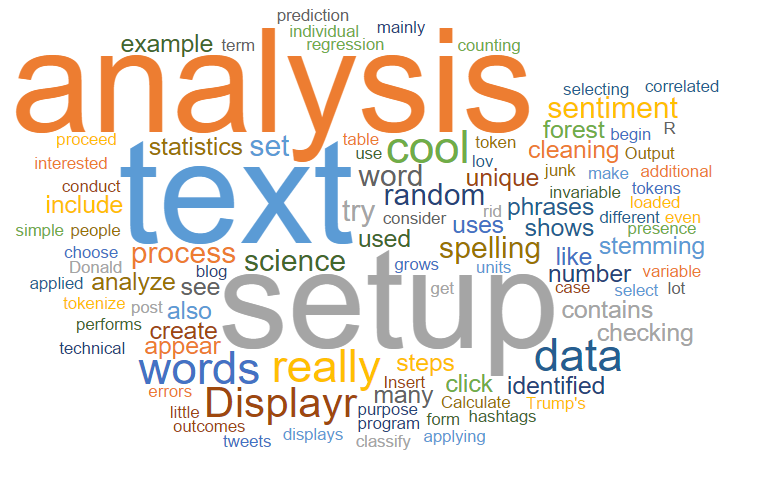
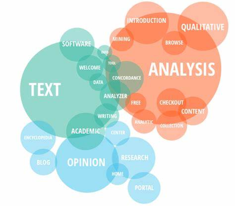
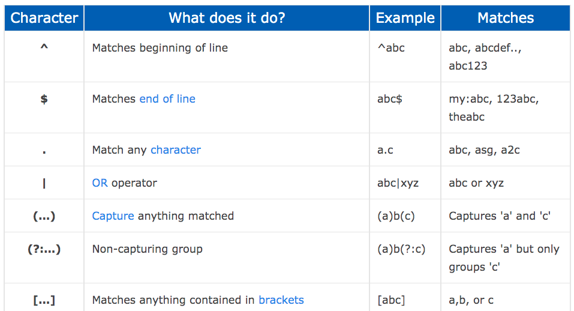

```{r setup, include=FALSE, cache=F, message=F, warning=F, results="hide"}
knitr::opts_chunk$set(cache=TRUE, echo=TRUE, message=FALSE, warning=FALSE, eval=FALSE)
knitr::opts_chunk$set(tidy.opts = list(width.cutoff = 60), tidy = TRUE)
knitr::opts_chunk$set(fig.path='figs/')
knitr::opts_chunk$set(tidy.opts = list(width.cutoff = 60), tidy = TRUE)
knitr::opts_chunk$set(cache.path='cache/')
knitr::opts_chunk$set(
                  fig.process = function(x) {
                      x2 = sub('-\\d+([.][a-z]+)$', '\\1', x)
                      if (file.rename(x, x2)) x2 else x
                      }
                  )
library(tidyverse)
library(stevemisc)
library(formatR)
```

Salam kenal dan selamat datang.

Semoga kita semua bisa saling berbagi pengalaman dan pengetahuan. Saya adalah Ujang Fahmi, Co-founder dan mentor Sadasa Academy.

\vspace{0.1in}

Jika anda berada dan sedang membaca tutorial ini, maka kemungkinan anda adalah orang yang sedang ingin belajar data sains, atau mungkin ditugaskan untuk mempelajari R oleh institusi atau organisasi anda. Sama seperti saya dulu, dimana tanpa latar belakang enginering saya didiharuskan untuk belajar R, demi menyelesaikan tugas akhir dan akhirnya jadilah seperti saya sekarang ini.

\vspace{0.1in}

Satu hal yang pasti, ini adalah langkah pertama dari banyak langkah yang harus dilalui, entah melalui lembaga resmi atau belajar secara mandiri. Jadi selamat belajar!!!

\vspace{0.1in}
Ujang Fahmi, 

`r paste("Yogyakarta,", Sys.Date())`

# Text Mining?

Text mining juga merujuk pada text data mining mirip dengan teks analitik, yaitu sebuah proses mendapatkan informasi yang berkualitas dari teks. Hal ini melibatkan penggunaan komputer untuk observasi, dan **informasi yang sebelumnya belum diketahui**. 

Text mining melibatkan teknik dan metode interdisiplin seperti pemerograman komputer untuk memproses data tidak terstruktur dalam jumlah besar dan linguistik untuk memahami dan mengambil intiusi tentang penggunaan bahasa.

source: [text.ai](https://www.tex-ai.com/5-important-text-mining-techniques-in-use-today/)

## Metode analisis

::: {.columns}
::: {.column width="50%"}

1. Term-based Method (Each term is associated with a value, known as weight)
2. Phrase-based Method (This method analyses a document based on phrases which carry more information than a single term)
3. Concept-based Method (This model tries to analyses a term on a document or sentence level by finding a significant matching term)
4. Pattern Taxonomy Method (Relation between terms to form taxonomy, which is a tree-like structure)
5. Metode hibrida pengolahan teks (e.g CADS)

:::
  
::: {.column width="50%"}



:::
:::

## Teknik analisis

1. **Extraction of Information** (The information extraction technique focuses a lot on identifying the extraction of attributes, entities, along with their relationship with unstructured or semi-structured texts)

2. **Retrieval of Information** (This technique makes use of information retrieval systems that make use of various algorithms that track and monitor user behaviour and also determine related data accordingly)

3. **Categorization** (This is a text mining technique which is a `supervised` learning form where the usual language texts are set to a pre-defined bunch of topics depending on their content)

4. **Clustering** (Clustering helps identify structures that are intrinsic in nature within text information and organize them in clusters or relevant subgroups for further analysis)

5. **Summarization** (Text summarization allows you to browse through various text sources in order to create summaries of texts which contain large amounts of information that are insightful in a concise format)

## Proses Analisis

::: {.columns}
::: {.column width="50%"}

1. Mendapatkan data (umumnya tidak/belum terstruktur)
2. Melakukan pre-proccessing (melibatkan data wrangling dan cleansing)
3. Membuat data terstruktur
4. Menyimpan dan menganalisis 

:::
::: {.column width="50%"}



:::
:::

# Memanfaatkan Regex (Regular Expression)

A regular expression (shortened as regex or regexp; also referred to as rational expression) is a sequence of characters that specifies a search pattern. Usually such patterns are used by string-searching algorithms for "find" or "find and replace" operations on strings, or for input validation. It is a technique developed in theoretical computer science and formal language theory. [wikipedia](https://en.wikipedia.org/wiki/Regular_expression)

## Penggunaan regex


source: [computerhope](https://www.computerhope.com/jargon/r/regex.htm)

# Pra-pemerosesan data teks 

Data teks yang umumnya tidak terstruktur biasanya juga masih banyak elemen yang tidak diperlukan dalam analisis. Oleh karena itu biasanya kita perlu membersihkan noise nya terlebih dahulu. 

## Noise removal

Noise removal disini termasuk tanda html (html tags, spasi yang lebih, tanda baca dan sambung, serta menyergamkan teks)

### Remove HTML tags

html tags yang umum ada dalam teks adalah url. Urls biasanya diawali dengan kelompok karakter spesifik, seperti: 

- http
- https
- www
- etc

[Buku untuk belajar regex di R/Handling Strings With R](https://www.gastonsanchez.com/r4strings/)


```{r, eval=TRUE}
teks = "Bpbd... 
        https://instagram.com/p/CT5xmXMP_xq/?utm_medium=twitter, 
        www.dodoremi.com, 
        pic.twitter..."
# teks

library(stringr)
teks = gsub(" ?(f|ht)(tp)(s?)(://)(.*)[.|/](.*)", "", teks)
```

### Remove extra whitespaces

```{r}
teks = " jagalah 3m, Menjaga Jarak, 
         kebersihan, dan menjaga hatii......."
teks

library(textclean)

# extra sapce
replace_white(teks)

# white space di depan/belakang
str_trim(string = teks, side = "both")
```

### Remove special characters

```{r}
teks = " jagalah 3m, Menjaga jarak, 
         kebersihan, dan menjaga hatii......."

library(textclean)
teks = replace_non_ascii(teks)
teks
```

### Remove Punctuations

```{r}
teks = " jagalah 3m, menjaga jarak, 
         kebersihan, dan menjaga hatii......."

teks = gsub(pattern = "[[:punct:]]", replacement = "", teks)
teks
```

## Lower atau Upper Case

```{r}
teks = "jagalah 3m, menjaga jarak"

teks = toupper(teks)
teks
teks = tolower(teks)
teks
```


## Pembersihan kata sambung

Untuk membersihkan kata sambung kita membutuhkan kamus kata sambung. Kamus ini biasanya sudah dibuat terlebih dahulu. Misalnya adalah sebagai berikut:

```{r, eval=TRUE, tidy=TRUE, tidy.opts=list(width.cutoff=60)}
stopwords_id = readr::read_csv("https://raw.githubusercontent.com/eppofahmi/belajaR/master/upn-surabaya/data/stopwords_id.csv")
```

[**sumber url-stopword**](https://raw.githubusercontent.com/eppofahmi/belajaR/master/upn-surabaya/data/stopwords_id.csv)

```{r, eval=TRUE, echo=FALSE}
head(stopwords_id, 5) %>% 
   knitr::kable()
```

### Konsep 1

```{r, eval=TRUE}
stopwords_id$kata <- paste0("\\b", stopwords_id$kata, "\\b")
stopwords_id$to <- ""
pattern <- as.character(stopwords_id$kata)
replacement <- as.character(stopwords_id$to)

teks = "yang aku bawa adalah buku pelajaran dan makanan buat siang nanti"

library(textclean)
mgsub_regex(teks, pattern = pattern, replacement = replacement, fixed = FALSE)
```


## Tokenisasi 

### One Gram
### Bigram
### Trigram 

