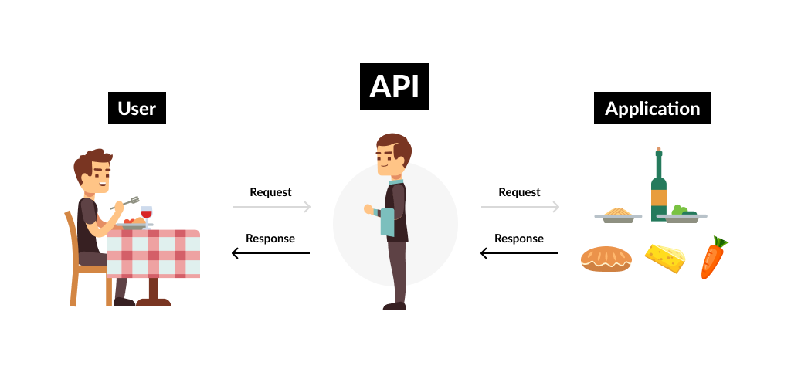

```{r setup, include=FALSE, cache=F, message=F, warning=F, results="hide"}
knitr::opts_chunk$set(cache=TRUE)
knitr::opts_chunk$set(fig.path='figs/')
knitr::opts_chunk$set(cache.path='cache/')

knitr::opts_chunk$set(
                  fig.process = function(x) {
                      x2 = sub('-\\d+([.][a-z]+)$', '\\1', x)
                      if (file.rename(x, x2)) x2 else x
                      }
                  )
library(tidyverse)
library(stevemisc)
```

Salam kenal dan selamat datang.

Semoga kita semua bisa saling berbagi pengalaman dan pengetahuan. Saya adalah Ujang Fahmi, Co-founder dan mentor Sadasa Academy.

\vspace{0.1in}

Jika anda berada dan sedang membaca tutorial ini, maka kemungkinan anda adalah orang yang sedang ingin belajar data sains, atau mungkin ditugaskan untuk mempelajari R oleh institusi atau organisasi anda. Sama seperti saya dulu, dimana tanpa latar belakang enginering saya didiharuskan untuk belajar R, demi menyelesaikan tugas akhir dan akhirnya jadilah seperti saya sekarang ini.

\vspace{0.1in}

Satu hal yang pasti, ini adalah langkah pertama dari banyak langkah yang harus dilalui, entah melalui lembaga resmi atau belajar secara mandiri. Jadi selamat belajar!!!

\vspace{0.1in}
Ujang Fahmi, 

`r paste("Yogyakarta,", Sys.Date())`

\vspace{0.1in}

*Materi yang disampaikan disimpan dan dokumentasikan* [**disini**](https://github.com/eppofahmi/belajaR/tree/master/upn-surabaya)

# API

API (Application Program Interface) merupakan suatu prosedur yang mengatur bagiamana sebuah aplikasi berkomunikasi satu sama lain. Hampir semua aplikasi yang ada secara daring menggunakan API untuk komunikasi datanya. 

\vspace{0.1in}

Sebagai contoh, Sebuah website yang menampilkan data membutuhkan API untuk menghubungkan antara halaman yang dilihat oleh publik/user dengan data base yang menampung data yang akan ditampilkan. 

## Kenapa?

API dipilih untuk digunakan untuk memastikan inti komunikasi dapat dicapai, dimana satu aplikasi bisa mengirim pesan atau permintaan dan mendapat feedback dari pesan tersebut. 

\vspace{0.1in}

Sebagai contoh, organisasi/lembaga seperti BPS yang memiliki banyak sekali data di webistenya menyediakan API yang bisa digunakan untuk mengajukan perminataan data spesifik. Tentunya dengan mengikuti prosedur yang ditetapkan dalam api. 

\vspace{0.1in}

Umumnya prosedur tersebut meliputi namun tidak terbatas pada: (1) key/password untuk akses; (2) request yang diperlukan; dan (3) parameter yang dibutuhkan. 

## Bagiamana?



# API Umum

Secara umum untuk bisa menggunakan API di R minimal kita perlu menginstall dua package berikut: 

1. httr
2. jsonlite

## Membuat permintaan (request)

::: {.columns}
::: {.column width="40%"}

Secara umum setidaknya ada tiga hal yang bisa dilakukan oleh kita (sebagai pengguna API), yaitu

1. GET() untuk mendapatakan data
2. POST() untuk mengirim data keserver
3. PUT()

Coba gunakan `?httr` untuk melihat dokumentasi terkait dengan semua yang bisa dilakukan menggunakan package ini.

:::
::: {.column width="60%"}

Contoh:

```{r, eval=FALSE}
library(httr)
library(jsonlite)

github_api <- function(path) {
  url <- modify_url(
     "https://api.github.com",
     path = path)
  GET(url)
}

what = "commits"
resp <- github_api(
   paste0(
      "/repos/eppofahmi/belajaR/", what))
```

:::
:::

## Mengolah data yang hasilkan

Data yang dihasilkan dari API biasanya berupa `json`. Untuk itu kita bisa menggunakan fungsi `fromJSON()` dari `jsonlite` untuk menjadikannya data frame atau list. 

```{r, eval=FALSE}
data = fromJSON(rawToChar(resp$content))
```

Di R, biasanya kita mengolah data dalam format data frame. Hasil dari API yang umumnya berupa json ada yang bisa langsung dikonversi menjadi data frame, namun jika hal tersebut tidak bisa dilakukan maka kita perlu mem-preprocessingnya terlebih dahulu. 

# Api Twitter

Twitter merupakan salah satu media sosial yang paling banyak digunakan, baik di Indonesia maupun di Dunia secara umum. Twitter juga memiliki beberapa pilihan api yang bisa digunakan oleh publik baik secara gratis maupun berbayar. 
\vspace{0.1in}
Pilihan untuk menggunakan yang gratis atau berbayar perlu disesuaikan dengan kebutuhan masing-masing. Selain itu, Twitter juga menyediakan akses API untuk kebutuhan riset akademis yang memiliki rentang pengambilan data lebih panjang dibanding yang gratis namun bisa didapatkan secara gratis. 

## Mendapatkan API Twitter

Untuk mendapatkan API Twitter kita perlu **mendaftar, membaca petunjuk resminya, dan mengikuti prosedur** yang telah ditetapkan oleh Twitter. 

Prosesnya kurang lebih sebagai berikut: 

1. Membuat akun Twitter (Jika belum punya)
2. Membuat aplikasi [di sini](https://developer.twitter.com/en/apply-for-access)
3. Mendapatkan API Key, API Key Secret, Access Token, Access Token Secret dan Bearer Token
4. Menggunakan Key dari langkah ke-3 untuk mengambil data

## Menggunakan API Twitter

Untuk bisa melihat tahapan mendapatakan Key API TWITTER bisa mengikuti petunjuk dengan menjalankan skrip berikut: 

```{r, eval=FALSE}
# uncomment untuk menginstall library
# install.packages("rtweet")

library(rtweet)
vignette("auth")
```


### Setup Autentifikasi

```{r, eval=FALSE}
library(rtweet)

token <- create_token(
  app = "app",
  consumer_key = "consumer_key",
  consumer_secret = "consumer_secret",
  access_token = "access_token",
  access_secret = "access_secret")
```

### Pengambilan data

```{r, eval=FALSE}
?rtweet::search_tweets

hasil = rtweet::search_tweets(q = "chelsea", 
                              n = 100, 
                              type = "mixed")
glimpse(hasil)
```

## Mengolah data yang di dapat

Untuk mengolah data Twitter, setidaknya ada dua hal yang bisa dijadikan sebagai awalah yaitu: 

1. Analisis user, yang bisa dilakukan menggunakan SNA
2. Analisis konten, yang bisa dilakukan menggunakan sentimen, topic modelling atau juga bisa menggunakan pendekatan network analisis. 
3. Terdapat beberapa package yang bisa digunakan untuk mengambil sekaligus analisis network seperti twitteR, graphTweets, dan lain-lain. 

