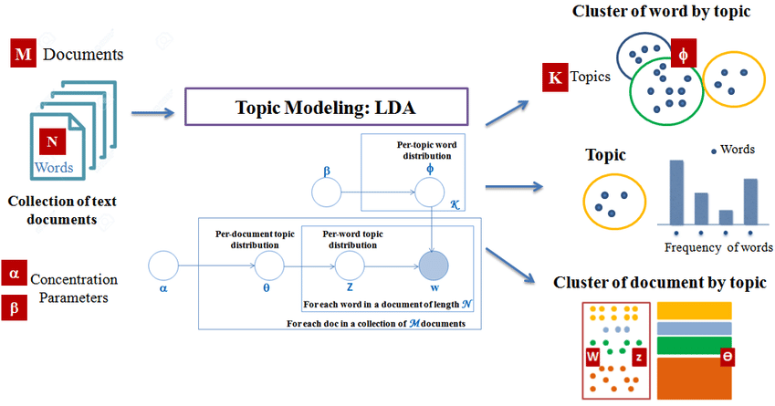

```{r setup, include=FALSE, cache=F, message=F, warning=F, results="hide"}
knitr::opts_chunk$set(cache=TRUE)
knitr::opts_chunk$set(fig.path='figs/')
knitr::opts_chunk$set(cache.path='cache/')

knitr::opts_chunk$set(
                  fig.process = function(x) {
                      x2 = sub('-\\d+([.][a-z]+)$', '\\1', x)
                      if (file.rename(x, x2)) x2 else x
                      }
                  )
library(tidyverse)
library(stevemisc)
```

Salam kenal dan selamat datang.

Semoga kita semua bisa saling berbagi pengalaman dan pengetahuan. Saya adalah Ujang Fahmi, Co-founder dan mentor Sadasa Academy.

\vspace{0.1in}

Jika anda berada dan sedang membaca tutorial ini, maka kemungkinan anda adalah orang yang sedang ingin belajar data sains, atau mungkin ditugaskan untuk mempelajari R oleh institusi atau organisasi anda. Sama seperti saya dulu, dimana tanpa latar belakang enginering saya didiharuskan untuk belajar R, demi menyelesaikan tugas akhir dan akhirnya jadilah seperti saya sekarang ini.

\vspace{0.1in}

Satu hal yang pasti, ini adalah langkah pertama dari banyak langkah yang harus dilalui, entah melalui lembaga resmi atau belajar secara mandiri. Jadi selamat belajar!!!

\vspace{0.1in}
Ujang Fahmi, 

`r paste("Yogyakarta,", Sys.Date())`

\vspace{0.1in}

*Materi yang disampaikan disimpan dan dokumentasikan* [**disini**](https://github.com/eppofahmi/belajaR/tree/master/upn-surabaya)

# Topic Modeling

> Pemodelan topik merupakan sebuah tipe pemodelan statistik untuk mengungkap abstrak topik yang ada dalam sebuah koleksi dokumen.

## Apa?

Topik modeling juga bisa disebut sebagai sebuah metode untuk menemukan kelompok kata (kemudian disebut topik) dari sebuah koleksi dokumen yang dianggap paling merepresentasikan informasi yang ada di dalamnya. Metode ini juga dapat dikelompokan sebagai metode text mining, yaitu sebuah cara untuk mendapatkan informasi dari teks. 

\vspace{0.1in}

Topic modeling juga dikategorikan sebagai unsupervised machine learning, yaitu sebuah machine learning yang tidak membutuhkan data latih yang sebelumnya telah dikategorikan secara manual oleh manusia. Oleh karena itu juga Topic modeling membutuhkan pendekatan dan atau metode lain untuk mengevaluasinya. 

## LDA ?


## Bagiamana?



# Langkah-langkah Topic Modeling

1. Membuat matrix term dan dokumen (document term matrices) dari data teks tabular
2. Menjalankan fungsi pemodelan topik LDA
3. Merapikan output ke dalam bentuk (tidy)
4. Menginterpretasi topik

## Data yang akan dianalisis

```{r, eval=FALSE}
library(tidyverse)
library(tidytext)
library(topicmodels)

raw_data = read_csv("data/tweet_save_monas.csv")
raw_data = raw_data %>% 
   select(id, full_text_clean) %>%
   group_by(id) %>% 
   unnest_tokens(word, full_text_clean, token = "words")

raw_data = raw_data %>% 
   filter(!is.na(word))

glimpse(raw_data)
```

## Membuat matrix term dan dokumen

```{r, eval=FALSE}
tweet_dtm = raw_data %>%
   count(word, id) %>%
   cast_dtm(id, word, n) %>% 
   as.matrix()
```

## Menjalan LDA

```{r, eval=FALSE}
lda_topics <- tweet_dtm %>%
  LDA(
    k = 2,
    method = "Gibbs",
    control = list(seed = 42)
  ) %>%
  tidy(matrix = 'beta')

lda_topics %>%
  arrange(desc(beta))

word_prob <- lda_topics %>%
  group_by(topic) %>%
  top_n(15, beta) %>%
  ungroup() %>%
  mutate(term2 = fct_reorder(term, beta))
word_prob
```

## Melihat Hasil

```{r, eval=FALSE}
word_prob %>% 
   ggplot(aes(term2, beta, fill = as.factor(topic))) +
   geom_col(show.legend = FALSE) +
   facet_wrap(~topic, scales = "free") +
   coord_flip()
```

# Your Turn

Buatlah topic modelling untuk data teks dengan parameter K yang lebih dari 2 dan interpretasikan.