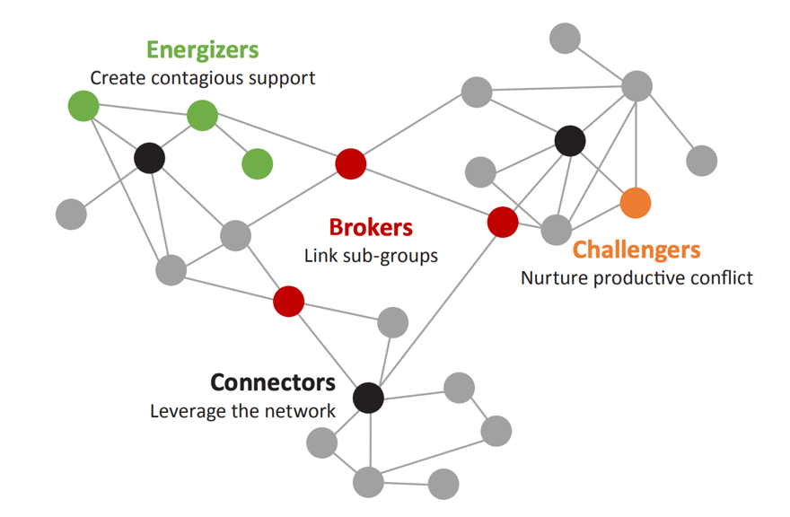
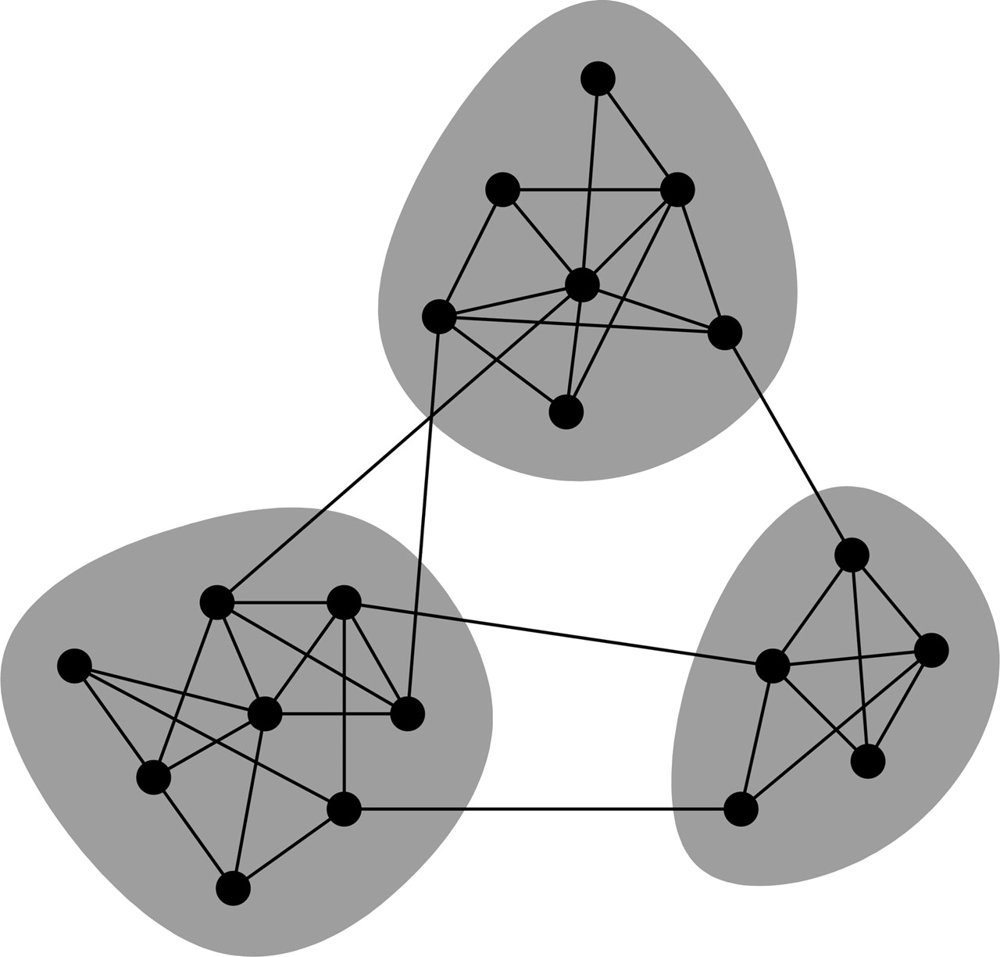

```{r setup, include=FALSE, cache=F, message=F, warning=F, results="hide"}
knitr::opts_chunk$set(cache=TRUE)
knitr::opts_chunk$set(fig.path='figs/')
knitr::opts_chunk$set(cache.path='cache/')

knitr::opts_chunk$set(
                  fig.process = function(x) {
                      x2 = sub('-\\d+([.][a-z]+)$', '\\1', x)
                      if (file.rename(x, x2)) x2 else x
                      }
                  )
library(tidyverse)
library(stevemisc)
```

Salam kenal dan selamat datang.

Semoga kita semua bisa saling berbagi pengalaman dan pengetahuan. Saya adalah Ujang Fahmi, Co-founder dan mentor Sadasa Academy.

\vspace{0.1in}

Jika anda berada dan sedang membaca tutorial ini, maka kemungkinan anda adalah orang yang sedang ingin belajar data sains, atau mungkin ditugaskan untuk mempelajari R oleh institusi atau organisasi anda. Sama seperti saya dulu, dimana tanpa latar belakang enginering saya didiharuskan untuk belajar R, demi menyelesaikan tugas akhir dan akhirnya jadilah seperti saya sekarang ini.

\vspace{0.1in}

Satu hal yang pasti, ini adalah langkah pertama dari banyak langkah yang harus dilalui, entah melalui lembaga resmi atau belajar secara mandiri. Jadi selamat belajar!!!

\vspace{0.1in}
Ujang Fahmi, 

`r paste("Yogyakarta,", Sys.Date())`

\vspace{0.1in}

*Materi yang disampaikan disimpan dan dokumentasikan* [**disini**](https://github.com/eppofahmi/belajaR/tree/master/upn-surabaya)

# Parameter pengkuran dalam SNA

1. Social network analysis (SNA) atau analisis jejaring sosial merupakan salah satu metode yang saat ini sering dibicarakan dan banyak diaplikasikan untuk berbagai kasus/studi. 

2. SNA banyak digunakan karena bisa diaplikasikan pada berbagai skenario jariangan baik yang melibatkan aktor manusia/username atau aktor bukan manusia seperti stasiun/jabatan. 

3. Mudahnya mendapatkan data, khususnya dari media sosial untuk dijadikan sebagai studi.

## Centrality

::: {.columns}
::: {.column width="50%"}

Social network analysis is the process of investigating social structures through the use of networks and graph theory. It characterizes networked structures in terms of nodes and the ties, edges, or links that connect them. 
\vspace{0.1in}
Dalam sebuah network centrality merupakan indikator yang melekat pada sebuah nodes. Centrality bisa memberikan informasi seperti nodes populer, nodes mana yang menjadi penghubung, dan nodes yang bisa memengaruhi network dengan cepat. 

:::
::: {.column width="50%"}



:::
:::

### Degree Centrality

**Definition**: Degree centrality assigns an importance score based simply on the number of links held by each node.

**What it tells us**: How many direct, ‘one hop’ connections each node has to other nodes in the network.

**When to use it**: For finding very connected individuals, popular individuals, individuals who are likely to hold most information or individuals who can quickly connect with the wider network.

**A bit more detail**: Degree centrality is the simplest measure of node connectivity. Sometimes it’s useful to look at in-degree (number of inbound links) and out-degree (number of outbound links) as distinct measures, for example when looking at transactional data or account activity.A bit more detail: Degree centrality is the simplest measure of node connectivity. Sometimes it’s useful to look at in-degree (number of inbound links) and out-degree (number of outbound links) as distinct measures, for example when looking at transactional data or account activity.

### Betweeness Centrality

**Definition**: Betweenness centrality measures the number of times a node lies on the shortest path between other nodes.

**What it tells us**: This measure shows which nodes are ‘bridges’ between nodes in a network. It does this by identifying all the shortest paths and then counting how many times each node falls on one.

**When to use it**: For finding the individuals who influence the flow around a system.

**A bit more detail**: Betweenness is useful for analyzing communication dynamics, but should be used with care. A high betweenness count could indicate someone holds authority over disparate clusters in a network, or just that they are on the periphery of both clusters.

### Closeness Centrality

**Definition**: Closeness centrality scores each node based on their ‘closeness’ to all other nodes in the network.

**What it tells us**: This measure calculates the shortest paths between all nodes, then assigns each node a score based on its sum of shortest paths.

**When to use it**: For finding the individuals who are best placed to influence the entire network most quickly.

**A bit more detail**: Closeness centrality can help find good ‘broadcasters’, but in a highly-connected network, you will often find all nodes have a similar score. What may be more useful is using Closeness to find influencers in a single cluster.

### Eigenvector Centrality

**Definition**: Like degree centrality, EigenCentrality measures a node’s influence based on the number of links it has to other nodes in the network. EigenCentrality then goes a step further by also taking into account how well connected a node is, and how many links their connections have, and so on through the network.

**What it tells us**: By calculating the extended connections of a node, EigenCentrality can identify nodes with influence over the whole network, not just those directly connected to it.

**When to use it**: EigenCentrality is a good ‘all-round’ SNA score, handy for understanding human social networks, but also for understanding networks like malware propagation.

**A bit more detail**: Our tools calculate each node’s EigenCentrality by converging on an eigenvector using the power iteration method.

### Page Rank

**Definition**: PageRank is a variant of EigenCentrality, also assigning nodes a score based on their connections, and their connections’ connections. The difference is that PageRank also takes link direction and weight into account – so links can only pass influence in one direction, and pass different amounts of influence.

**What it tells us**: This measure uncovers nodes whose influence extends beyond their direct connections into the wider network.

**When to use it**: Because it takes into account direction and connection weight, PageRank can be helpful for understanding citations and authority.

**A bit more detail**: PageRank is famously one of the ranking algorithms behind the original Google search engine (the ‘Page’ part of its name comes from creator and Google founder, Sergei Brin).

## Modularity

::: {.columns}
::: {.column width="50%"}

**Modularity** adalah sebuah perhitungan yang mengukur kekuatan/kedekatan antar divisi dalam sebuah jejaring dan mengelompokannya menjadi modul (grup, kluster, atau komunitas). 

\vspace{0.1in}

Network yang memiliki moudularity tinggi memiliki densitas koneksi antar nodes di dalamnya, namun jauh/jarang dengan nodes dari modul/grup lain. Modularity sering digunakan sebagai metode optimasi untuk mendeteksi struktur komunitas dalam sebuah jejaring. 

:::
::: {.column width="50%"}



:::
:::

# Mendapatkan Network Centrality

## Degree Centrality

::: {.columns}
::: {.column width="50%"}

Degree merupakan struktur paling dasar dalam sebuah jejaring. Degree bisa didapat dari sebuah graph di r menggunakan fungsi `degree()` dari `igraph`.

:::
::: {.column width="50%"}

```{r, eval=FALSE}
library(igraph)

g <- make_ring(10)
degree(g)
g2 <- sample_gnp(1000, 10/1000)
degree_distribution(g2)
```

:::
:::

## Betweeness Centrality

::: {.columns}
::: {.column width="50%"}

Betweeness bisa diterapkan untuk nodes dan edeges. Di igraph kita bisa menggunakan fungsi `betweenness()` untuk nodes, dan `edge_betweenness()` untuk edges. 

:::
::: {.column width="50%"}

```{r, eval=FALSE}
library(igraph)
g <- sample_gnp(10, 3/10)
betweenness(g)
edge_betweenness(g)
```

:::
:::

## Closeness Centrality

::: {.columns}
::: {.column width="50%"}

Closeness dari sebuah network bisa didapat menggunakan fungsi `closeness()` dari `igraph`. Di sini closeness memiliki tiga mode dengan mempertimbangkan tipe networknya (directed atau undirected).

:::
::: {.column width="50%"}

```{r, eval=FALSE}
g <- make_ring(10)
g2 <- make_star(10)
closeness(g)
closeness(g2, mode="in")
closeness(g2, mode="out")
closeness(g2, mode="all")
```

:::
:::

## Eigenvector Centrality

Eigenvector bisa didapatkan dari sebuah graph menggunakan fungsi `eigen_centrality()`.

```{r, eval=FALSE}
#Generate some test data
g <- make_ring(10, directed=FALSE)
#Compute eigenvector centrality scores
eigen_centrality(g)
```

## Page Rank

Fungsi `page_rank()` bisa digunakan untuk mengukur `page_rank()` yaitu sebuah algoritme yang dibuat dan digunakan oleh google untuk memberikan peringkat pada sebuah laman. 

```{r, eval=FALSE}
g <- sample_gnp(20, 5/20, directed=TRUE)
page_rank(g)$vector

g2 <- make_star(10)
page_rank(g2)$vector

# Personalized PageRank
g3 <- make_ring(10)
page_rank(g3)$vector
reset <- seq(vcount(g3))
page_rank(g3, personalized=reset)$vector
```

# Mendapatkan Network Modularity

Modularity bisa dikalkulasi dengan menggunakan beberapa metode di R. Untuk memilih metode yang cocok digunakan dalam sebuah network perlu mempertimbangkan karakteristik network dan tujuan analisisnya. 

\vspace{0.1in}

> Notes: Operator `%du%` digunakan untuk menggabungkan dua graph atau lebih dalam igraph.  

## Betweeness 

```{r, eval=FALSE}
g <- sample_pa(100, m = 2, directed = FALSE)
eb <- cluster_edge_betweenness(g)

g <- make_full_graph(10) %du% make_full_graph(10)
g <- add_edges(g, c(1,11))
eb <- cluster_edge_betweenness(g)
eb
```

## Fast greedy

```{r, eval=FALSE}
g <-
   make_full_graph(5) %du% make_full_graph(5) %du% make_full_graph(5)
g <- add_edges(g, c(1, 6, 1, 11, 6, 11))
fc <- cluster_fast_greedy(g)
membership(fc)
sizes(fc)
```

## Walk Trap

```{r, eval=FALSE}
g <- make_full_graph(5) %du% make_full_graph(5) %du% make_full_graph(5)
g <- add_edges(g, c(1,6, 1,11, 6, 11))
cluster_walktrap(g)
```

## More on Igraph 

https://igraph.org/r/doc/